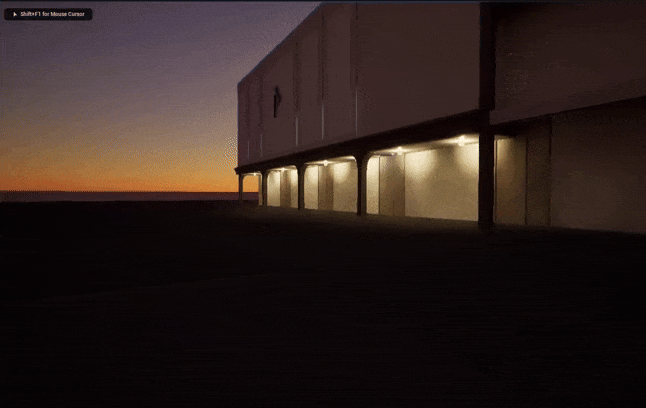

# Project Details

The purpose of this document is a mix of things - a development log, a guide, a post-mortem on the project's successes and failures, etc.

This project was conceived of so I could experiment with Unreal Engine for the first time, as well as attempt to produce a comparison to the original mall that was made in Unity. I wanted to timebox the project to approximately a month, and then re-evaluate if it is worth continuing forward with. The anticipated workflow looked something like this:

1. Add the mall FBX files
2. Light the scene
3. Add additional functions like NPCs, music, etc.

Of course, it is rarely ever that easy, and the first sign of problems came rather quickly. Before I could even import all of the assets for one complete version of the mall, let alone add lighting or other features, the amount of time it took to save and load the level became unwieldy, so I reduced the scope to a single anchor store. Even with the smaller version, I'm prone to seeing errors on screen about running out of GPU memory, as well as prolific screen tearing, but these aren't completely prohibitive. I think these can be chalked up to having an underpowered laptop for these kind of use cases.

## Import FBX Scenes

In Unreal, there is an option "File" > "Import Into Level" which I used for each FBX file. I retained most of the folder structure from the original project, with the FBX files in the "Content" folder, minus the Unity-specific *.meta files and the Materials and Textures folders. Similar to Unity, it extracts details out of the scene, and it was nice that it placed everything spatially in the correct position. The not-so-nice thing is all the issues I experienced with collisions and materials. There are also a lot of warnings that pop up, far too many to analyze, but I think most of them are trivial (i.e. renaming materials with underscores instead of spaces). It will create a bunch of `*.uasset` files for the meshes, materials, textures, etc.

### Collisions

The "Generate Missing Collision" option on export is worth checking the first time doing an import, but then it's crucial to check the collision afterward.

One might think the collision just maps 1:1 with the mesh, but I'd often find that to not be the case:

As we can see from these purplish lines, it generated some collisions outside of the range of the meshes. This is no good as it will create an "invisible wall" effect when we play the game.

In cases like these, I would undo my work, re-import and leave "Generate Missing Collision" unchecked. After importing the FBX, it creates a scene, which can then be edited, and then the mesh can be edited from there:

The prefered "quick and easy" option is the "Auto Convex Collision" but I'd still find it sometimes produces the same kind of issues of filling in unwanted gaps:

Instead, I used "Box Simplified Collision" more often. This is what that looks like on a finished result:

This is not really a sustainable method to imagine doing to the full mall, as it's rather tedious. When creating a box simplified collision, it will create it around the entire space. I had to shrink down the box, then make more and follow the same process of resizing, moving and rotating. One of the difficulties with this is that it's hard to find that happy medium between too narrow and too wide when resizing, even with snapping to grid turned off. Collisions that are too narrow are what create that "clipping" effect where, e.g., you can't walk through a wall, but if you get really close you'll be "inside" it and seeing what's behind it.

### Material Fixes

Another issue I experienced is materials not importing correctly. For example, it'll be the wrong color, or glass won't be transparent. Here's an example of that - the mall is overall extremely white, even down to the solid white glass. The first screenshot was taken after I had already fixed some of the glass; the second is after fixing the remainder of the glass, so you can clearly compare and tell how the glass initially looked like a white wall.

  

From the source fbx files, there are a few properties a material can have, sometimes in combination:

- A simple color
- A texture
- A texture tint
- A bump map (normal map)
- A metallic property
- A transparency property

There are more than this available, but these are all that I encountered that the JCP anchor actually uses. I found Unreal to be pretty reliable with importing the textures and bump maps, but not the others, so they required some fixing.

#### Fixing Simple Colors

I noticed that there's a difference in Unreal between setting a base color directly and having a node with the base color. I think there are probably some broader material or lighting settings I don't understand yet that could "fix" the node-based color, but since I found that setting the color directly looked closer to the Unity color, I just used that as a workaround.

  

#### Fixing Tints

The absence of tints is why the mall looked so white, since the base textures were meant to be tinted, and therefore predominantly white. Fixing them is subject to the same phenomenon of setting a base color. In cases where the texture had a normal map available, I'd just recolor it directly, because the texture sample is redundant to the normal map. Here's an example of that - the disconnected nodes are not a factor here:

But, once again, if I hook the same color up through a node, it expresses it differently:

Then there are the ones with no normal maps, so I have to blend the color. I think this of course makes materials look brighter than in the Unity version, but I wasn't sure of any other way around it:

#### Fixing Metallic Property

This one is pretty simple, fortunately. In Unity there sre similar parameters, although I think the roughness (which is the inverse in Unity, smoothness) also comes into play. I didn't try too much to make these 1:1 because I'm not sure how the numbers and properties equate between engines. But you can see that adding this property gives the texture some reflective sheen.

#### Fixing Transparency Property

Admittedly I just cribbed this setup entirely from a tutorial for glass, so I don't completely understand in depth what each property means. Obviously changing the Blend Mode to Translucent is key, but it's also important to give it some reflection and refraction so that it doesn't just look like an invisible texture.

## Lighting Implementation

The above issues with materials and textures were nothing compared to trying to resolve the lighting. As I would come to find out, lighting in Unreal is a pretty complex web of options that can drastically change the look of a level. I also found that, unfortunately, a lot of these options did not do what I expected of them from countless docs, tutorials and help posts.

### Emissive Material

Let's start with emissive materials, which are how the Unity version of the game produces all of its "artificial" lighting. This concept exists in Unreal as well, but my attempts at using emissives produced some alarming results, best exemplified by this gif:

Ignoring the fact I had the emissive applied to the wrong material here accidentally, this exemplifies the problems I had with emissives:

- They don't produce much light on the material they're shining on (i.e. the floor)
- In spite of this, the light in the fixture itself appears way too bright
- Worst of all, they only cast light when on camera, which is what produces that splotchy effect when moving

The above example isn't my best use of the emissive materials, but regardless, I found in spite of trying different alleged fixes, I still couldn't get the spotty, disappearing behavior to go away. The other option is to place discrete light actors, which I did to varying effect in different locations of the structure.

### Fluorescent Interior Lights

There is a concept of a rectangular light, which I don't think I'm using as intended, but nevertheless proved to be convenient for the interior fluorescent fixtures. Somehow the texture worked out decently in making it actually look like light is coming out of the fixture:

Unfortunately, the engine struggles to calculate shadows when light sources are close to one another, but that's not really fixable without removing some of the lights. That error is shown above, but the screenshot doesn't capture the massive framerate drop this caused.

There is fortunately a toggle to make lights not cast shadows, but it obviously does not look as good. Here is an example of that, although keep in mind this was taken with an earlier version of the textures:

By the way, there were over 500 of these lights between the three floors, and they all needed to be placed manually. At least they are all aligned in a grid, so I'd make one row, then copy the entire row to the next column, and then eventually I could even copy an entire floor's worth and simply change the Z coordinate to place them correctly. But this is another process that is hard to imagine would be viable to attempt with the full mall.

### Display Case Lights

In the previous part, I said that "somehow" the fluorescent lights looked pretty real. That's because most of the time, if you add lights they show up as a disembodied area of light, as I would find out when moving on to the display cases. The following screenshots are of my first attempts with each of the three main types of artificial light - a point light, rectangular light and spotlight, respectively:

  
  

As you can see, I tried to make the first two types overlap with the fixture, but it didn't work all that well. What I ended up doing is a mix of emissive textures for the fixtures with rectangle lights providing the bulk of the actual lighting:

  

It works okay, although it is hard to get rid of the moving spots of light produced by the emissives, as I had to strike a balance between making the emissive noticeable enough on the fixture without actually lighting the ground too much.

### Soffit Lights

I used a similar approach for the soffit lights of mixing emissives with discrete light actors, at least for the amber colored lights. For the white lights, these are actually the same material as the big fluorescent lights, so I couldn't make them emissive, but it means the same approach of putting a rectangular light slightly above still works pretty well:

But again I got the jittery light effect. This didn't seem like it was a result of the emissives this time (as they are set pretty dim), so I think it might be a difference with using a point light instead of a rectangular light:

### Signage Lights

TBD

### Sunlight

TBD

### Unresolved Light Issues